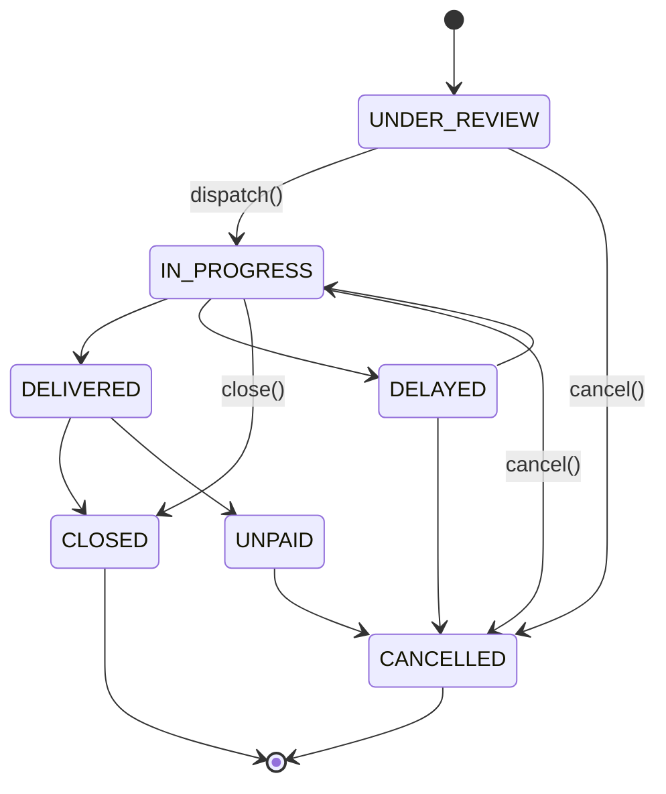

# MercadoX Core Service

## Overview

`mercado-x-core` is the central business domain service of the MercadoX ecosystem. It owns Orders, Items/Inventory, Carts, Leads, Locations, and Organizations, and orchestrates the order lifecycle end-to-end — from cart checkout through dispatch, delivery, and cancellation — while publishing domain events for downstream services (`mercado-x-email`, `mercado-x-ai`) to act on.

It does not authenticate users or send notifications itself; it delegates those to `mercado-x-oauth` and `mercado-x-email` respectively and stays focused on domain logic.

---

## Prerequisites

- Java 17
- Maven 3.8+
- Docker and Docker Compose
- Access to the GitHub Packages registry for `hn.shadowcore` internal libraries

---

## Quick Start

### 1. Start infrastructure

From the repo root:

```bash
docker-compose up -d
```

This starts PostgreSQL (5432), Redis (6379), Kafka (9092), Zookeeper, and Schema Registry (8085).

### 2. Initialize the database schema

The schema is owned by `mercado-x-library-jpa` and must be applied once before first boot:

```bash
docker exec -i mercadox-postgres psql -U postgres -d mercado_x < /path/to/mercado-x-library-jpa/src/main/resources/schema.sql
```

### 3. Provide the JWT verification key

`mercado-x-core` verifies tokens issued by `mercado-x-oauth` — it only ever needs the **public** key:

```bash
mkdir -p secrets
cp /path/to/mercado-x-oauth/secrets/public.pem secrets/public.pem
```

### 4. Run the service

```bash
mvn spring-boot:run
```

The service starts on `http://localhost:8080`.

---

## API Surface

| Resource | Method | Path | Description |
|---|---|---|---|
| Orders | `POST` | `/api/v1/orders/place` | Place an order from a cart (idempotent) |
| Orders | `POST` | `/api/v1/orders/dispatch` | Assign a driver and decrement stock |
| Orders | `POST` | `/api/v1/orders/close` | Close a delivered order |
| Orders | `DELETE` | `/api/v1/orders/{orderId}` | Cancel an order and restock items |
| Orders | `GET` | `/api/v1/orders/{orderId}` | Fetch order details |
| Cart | `GET` | `/api/v1/cart/{cartId}` | Fetch a cart |
| Cart | `POST` | `/api/v1/cart/{cartId}/item/{itemId}` | Add an item to a cart |
| Cart | `DELETE` | `/api/v1/cart/{cartId}/item/{itemId}` | Remove an item from a cart |
| Cart | `DELETE` | `/api/v1/cart/{cartId}` | Empty a cart |
| Items | `POST` | `/api/v1/items` | Create an item |
| Categories | `GET` | `/api/v1/categories` | List categories |
| Locations | `GET` | `/api/v1/locations/{locationId}` | Fetch a location |
| Organizations | `GET`, `POST` | `/api/v1/organizations` | Fetch / create an organization |
| Users | `GET` | `/api/v1/users/{id}`, `/api/v1/users?username=` | Fetch a user |
| Drivers | `GET` | `/api/v1/drivers` | List available drivers |
| Leads | `POST` | `/api/v1/public/orgs/{orgId}/leads` | Public lead capture (no auth) |

---

## Order Lifecycle

Order transitions are enforced by `OrderStatus.transitionTo()` — an illegal transition (e.g. dispatching a `CLOSED` order) throws `IllegalStateException` instead of silently corrupting state.



---

## Design Decisions

### Preventing overselling under concurrent dispatch

`dispatch()` and `cancel()` mutate `Item.unitQuantity` for every line item in an order. Under concurrent requests, a plain read-modify-write on stock is a classic lost-update race: two dispatches can both read quantity `1`, both decrement to `0`, and oversell.

`ItemService.getItemDetailsForUpdate()` issues `SELECT ... FOR UPDATE` (`@Lock(PESSIMISTIC_WRITE)`) so the row is locked for the duration of the enclosing `@Transactional` method, serializing concurrent stock updates on the same item. Line items within an order are locked in a **fixed order (sorted by item ID)** before mutation — without this, two orders dispatching the same two items in opposite order could deadlock against each other's locks.

### Idempotent order placement

`place()` is annotated `@IdempotentOperation(ttlMinutes = 15, keyPrefix = "order:place:")`, backed by `IdempotencyAspect` in `mercado-x-context`. It performs a single atomic Redis `SETNX` keyed on the caller-supplied idempotency key — a retried "place order" request (double-tap checkout, client timeout-and-retry) is rejected rather than creating a duplicate order. The Redis key is deleted on failure so a genuine server error can be retried.

This reuses the same atomic-check pattern already used to dedupe Kafka consumer processing (`KafkaIdempotencyAspect`), applied here at the API boundary instead of the message boundary.

### Enforced state transitions

`OrderStatus` declares its own allowed-transition set and exposes `transitionTo()`, so illegal transitions fail loudly at the point of mutation instead of being caught (or missed) later by ad hoc status checks scattered across the service.

---

## Configuration Reference

```yaml
server:
  port: 8080

spring:
  datasource:
    url: jdbc:postgresql://localhost:5432/mercado_x
    username: postgres
  jpa:
    hibernate:
      ddl-auto: validate   # never modifies schema — requires schema.sql to be run first

security:
  jwt:
    public-key-location: ${JWT_PUBLIC_KEY_LOCATION:file:./secrets/public.pem}
```

---

## Running Tests

```bash
mvn test
```

---

## Internal Dependencies

| Module | Purpose |
|---|---|
| `mercado-x-library-jpa` | JPA entities, repositories (`findByIdForUpdate` row locking), master schema |
| `mercado-x-context` | Org-tenant context propagation, `@IdempotentOperation` / `IdempotencyAspect`, Kafka producer factory |
| `mercado-x-redis` | Redis client configuration backing the idempotency aspect |
| `mercado-x-oauth` | JWT verification (public key only — no network calls at request time) |

---

## Does NOT Handle

- Authentication (delegated to `mercado-x-oauth`)
- Notification delivery — email/WhatsApp (delegated to `mercado-x-email`, triggered via Kafka)
